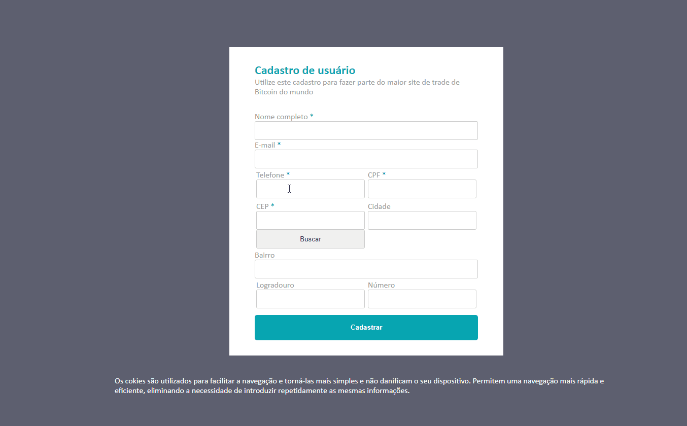

<h1 align="center">Tela de Cadastro de Usuários com Validação dos Campos</h1>

Projeto de estudo prático para criação de uma tela de login de usuário, desenvolvido em HTML, CSS e JS puro.

Tarefas pendentes:

[X] Criar o layout da tela de cadastro.

[X] Deixar o layout da tela de cadastro Resposiva.

[X] Implementar máscaras nos inputs de CPF e Telefone.

[ ] Implementar caixinhas em vermelho (Modal ou snackbar) para printar os erros para o usuário.

[ ] Ao Cadastrar, usar uma caixa (Modal) para exibir o sucesso do cadastro e ao clicar em "ok" a pessoa será redirecionada para a página de exibição.

[X] Validação dos inputs obrigatórios. 

[ ] Validar a sequência do CPF.

[X] Implementar para que os inputs (CPF, CEP e Número) aceitem somente números, não poderá aceitar letras.

[X] Consumir a API de CEPs para buscar a validação do endereço. API para busca de CEP: https://viacep.com.br/ws/{{CEP}}/json/

[X] Criar o método para quando receber os dados da API, "autopreencher" os campos de cidade, bairro e logradouro.

<h3> Deploy: https://viniciuslemos93.github.io/tela-cadastro/

<h1 align="center">Gif do Resultado</h1>

<h2 align="center">Tecnologias Usadas</h2>

     
 
        
        
         
    

